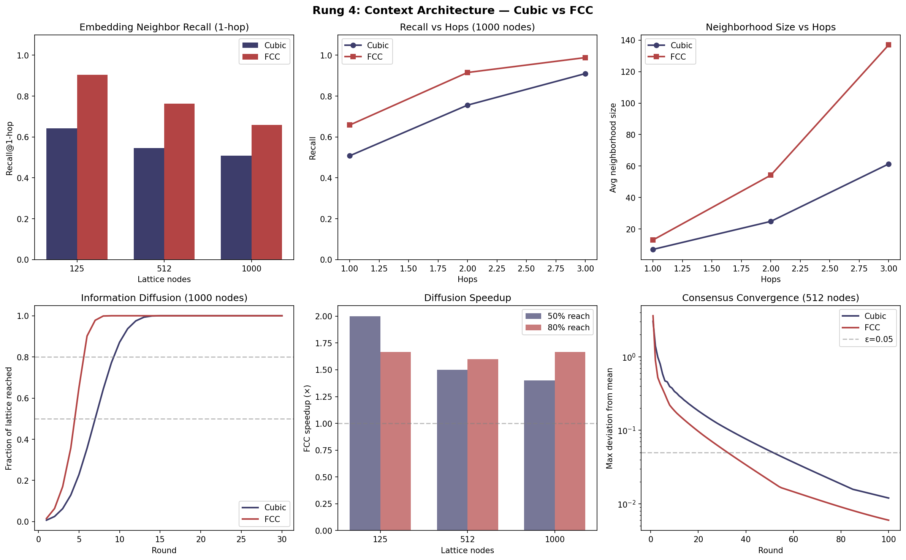

[](https://pypi.org/project/rhombic/)
[](https://github.com/tasumermaf/rhombic/actions/workflows/ci.yml)
[](https://pypi.org/project/rhombic/)
[](https://opensource.org/licenses/MPL-2.0)

# rhombic

> *The bottleneck is not the processor. It is the shape of the cell.*

A benchmarking library that compares cubic (6-connected) and FCC/rhombic
dodecahedral (12-connected) lattice topologies across graph theory,
spatial operations, and signal processing.

## The Numbers

| Metric | FCC vs Cubic | Scale |
|--------|-------------|-------|
| Average shortest path | **30% shorter** | 125 – 8,000 nodes |
| Graph diameter | **40% smaller** | 125 – 8,000 nodes |
| Algebraic connectivity | **2.4× higher** | 125 – 8,000 nodes |
| Flood fill reach | **55% more nodes** | 125 – 8,000 nodes |
| NN query speed | **17% faster** | 125 – 8,000 nodes |
| Signal reconstruction | **4-10× lower MSE** | 216 – 1,000 samples |
| Reconstruction isotropy | **5-20× more uniform** | 216 – 1,000 samples |
| Embedding neighbor recall | **+15-26pp at 1-hop** | 125 – 1,000 nodes |
| Information diffusion | **1.4-2× faster** | 125 – 1,000 nodes |
| Edge cost | ~2× more edges | (the price) |

These ratios are stable across all tested scales. They hold at every size
tested, consistent with derivation from Voronoi cell geometry rather than
sample size.




### Under Structured Weights (Paper 2)

| Metric | Corpus vs Uniform | Scale |
|--------|-------------------|-------|
| Fiedler ratio (direction-weighted) | 2.3x → **6.1x** | 125 – 8,000 nodes |
| Path advantage | 30% → **60% shorter** | 125 – 1,000 nodes |
| Consensus speedup | 1.0x → **6.7x** | 125 nodes |
| Prime-vertex coherence | **p = 0.000025** | Single cell (40,320 permutations) |

Heterogeneous edge weights amplify the FCC advantage. Direction-based
weighting — mapping structured values to the 6 direction pairs of the
FCC lattice — nearly triples the Fiedler ratio. The mechanism is
bottleneck resilience: FCC routes around suppressed edges that strangle
cubic lattices.

- [Raw data and tables](results/paper2/RESULTS.md)
- [What the numbers mean](results/paper2/INTERPRETATION.md)

## The Question

Computation is built on the cube. Memory is linear. Pixels are square.
Voxels are cubic. Nobody chose this — it accumulated. Descartes gave us
orthogonal coordinates. Von Neumann gave us linear memory. The cubic
lattice is the spatial expression of Cartesian geometry.

Is the cube optimal? This library measures the alternative: the
face-centered cubic lattice, whose Voronoi cells are rhombic
dodecahedra. 12 faces instead of 6. The densest sphere packing in
three dimensions (Kepler, proved by Hales 2005, formally
verified 2017). The lattice that nature
uses for copper, aluminum, and gold.

[Read the full thesis →](docs/THESIS.md)

## Quick Start

```bash
pip install rhombic            # minimal (numpy + networkx)
pip install "rhombic[viz]"     # add matplotlib for plots
pip install "rhombic[all]"     # everything including dev tools
```

Reproduce all results:

```bash
python -m rhombic.benchmark
```

Use in code:

```python
from rhombic.lattice import CubicLattice, FCCLattice

cubic = CubicLattice(n=10)     # 1000 nodes, 6-connected
fcc = FCCLattice(n=6)          # ~864 nodes, 12-connected

# Convert to networkx for any graph analysis
G_cubic = cubic.to_networkx()
G_fcc = fcc.to_networkx()
```

Compare topologies:

```python
from rhombic.lattice import CubicLattice, FCCLattice

cubic, fcc = CubicLattice(5), FCCLattice(5)
print(f"Cubic: {cubic.stats().connectivity}-connected, {cubic.stats().node_count} nodes")
print(f"FCC:   {fcc.stats().connectivity}-connected, {fcc.stats().node_count} nodes")
# Cubic: 6-connected, 125 nodes
# FCC:   12-connected, 500 nodes
```

## Results

### Rung 1: Graph Theory (complete)

Four metrics, three scales, consistent ratios. The FCC lattice outperforms
the cubic lattice on every measure of routing efficiency and structural
robustness. The cost is bounded: ~2× edges for ~30% shorter paths and
~2.4× robustness.

- [Raw data and tables](results/rung-1/RESULTS.md)
- [What the numbers mean](results/rung-1/INTERPRETATION.md)

### Rung 2: Spatial Operations (complete)

The routing advantage translates. FCC flood fill reaches 55% more nodes
per hop. Nearest-neighbor queries are 17% faster. Range queries return
24% more nodes per volume (denser packing). The cost: range query time
scales with density — 3-5× slower for sphere/box queries at 8,000 nodes.

- [Raw data and tables](results/rung-2/RESULTS.md)
- [What the numbers mean](results/rung-2/INTERPRETATION.md)

### Rung 3: Signal Processing (complete)

Direct empirical measurements confirm the FCC advantage. FCC spatial sampling
produces **4-10× lower MSE** and **5-20× more isotropic** reconstruction than
cubic sampling at matched sample counts. The advantage peaks in the mid-frequency range (10-60% of
Nyquist) and grows with scale — from +6 dB at 216 samples to +10 dB at 1,000.
Above Nyquist, both lattices alias and cubic's axis alignment accidentally helps.

- [Raw data and tables](results/rung-3/RESULTS.md)
- [What the numbers mean](results/rung-3/INTERPRETATION.md)

### Rung 4: Context Architecture (complete)

Does the FCC advantage survive when the lattice organizes high-dimensional
embedding data? FCC captures **15-26 more percentage points** of an embedding's
true nearest neighbors at 1-hop. Information diffuses **1.4-2× faster**.
Consensus converges 1.58× faster at moderate scale (500 nodes), though
per-neighbor weight dilution reduces the advantage at 1,000 nodes.

- [Raw data and tables](results/rung-4/RESULTS.md)
- [What the numbers mean](results/rung-4/INTERPRETATION.md)

[Full experimental ladder →](docs/EXPERIMENTAL_LADDER.md)

### FCC Embedding Index (complete)

A proof-of-concept ANN index that organizes high-dimensional embeddings on
lattice topology. At matched node counts, the FCC index captures **+7 to +20
percentage points** more true nearest neighbors at 1-hop than the cubic index.
The only variable is the connectivity pattern.

```python
from rhombic.index import FCCIndex, CubicIndex, brute_force_knn

fcc = FCCIndex.from_target_nodes(dim=384, target_nodes=500).build(embeddings)
results = fcc.query(query_vector, k=10, hops=1)
recall = fcc.recall_at_k(queries, ground_truth, k=10, hops=1)
```

- [Raw data and tables](results/index/RESULTS.md)
- [What the numbers mean](results/index/INTERPRETATION.md)

### Paper 2: Weighted Extensions (complete)

What happens when edges carry heterogeneous weights? Seven experiments across
two scales (lattice and single-cell). The FCC advantage **amplifies** under
structured weights — direction-based corpus weighting pushes the Fiedler ratio
from 2.3x to 6.1x. Prime-vertex coherence is significant at the optimal
mapping (p = 0.000025 vs 40,320 alternatives). Spectral bottleneck creation
is universal across 24-edge polytopes, not RD-specific.

- [Raw data and tables](results/paper2/RESULTS.md)
- [What the numbers mean](results/paper2/INTERPRETATION.md)

### Paper 3: The Learnable Bridge (13 experiments, 312 tests)

Thirteen experiments across four model families (1.1B–14B parameters),
demonstrating that a cybernetic feedback mechanism discovers rhombic
dodecahedral geometry in multi-channel LoRA bridge matrices.

**Key finding:** When the Steersman (contrastive + spectral feedback) is
active at channel count n=6, 100% of bridge matrices develop block-diagonal
structure aligned to the three coordinate planes of the rhombic dodecahedron.
Without the Steersman: 0%. The co-planar/cross-planar coupling ratio peaks
at 82,854:1. Structure locks in by step 200, survives adversarial initialization,
and costs 0.17% validation loss.

| Finding | Value |
|---------|-------|
| Block-diagonal rate (cybernetic n=6) | **100%** (42,500+ matrices) |
| Block-diagonal rate (non-cybernetic) | **0%** (570 matrices) |
| Peak co-planar/cross-planar ratio | **82,854:1** |
| Lock-in speed | **~200 steps** (half-life 123 steps) |
| Adversarial initialization suppression | **99.5% in 900 steps** |
| Bridge Fiedler bifurcation (n=6 vs n≠6) | **1,020×** |
| Val loss cost of topology | **0.17% max** |
| Scale invariance | **1.1B, 7B, 14B** (Fiedler converges ~0.10) |

**7-round adversarial audit complete.** 232 findings across 7 rounds, 87
fixed, zero CRITICAL or MAJOR findings remaining. Both Papers 2 and 3 are
submission-ready.

- [Audit trail](paper/audit/) — full findings, hub validations, rewrite log
- [Cross-phase synthesis](results/CROSS_PHASE_SYNTHESIS.md)

### Synthesis

The complete argument across all four rungs — cultural genealogy, empirical
evidence, cybernetic interpretation, and practical recommendations.

- [The Shape of the Cell: Cubic vs FCC Lattice Topology Across Four Domains](results/SYNTHESIS.md)

## Philosophy

- Reproducible by default. Every result has code that generates it.
- The geometry is the argument. The numbers are the evidence.
- Cost is always reported alongside benefit.
- Sparse results are data, not failure.

## Interactive Agent

`rhombic-agent` — a [Hermes Agent](https://github.com/NousResearch/hermes-agent)
that thinks in 12 dimensions. 9 custom tools + 3 conversational skills. Ask it
to run experiments, generate visualizations, and explain the geometry.

[Hackathon Demo →](https://tasumermaf.github.io/rhombic/)

## Ecosystem

- [Interactive demo](https://huggingface.co/spaces/timotheospaul/rhombic) — try it in your browser
- [The essay](https://timotheospaul.substack.com/p/the-shape-of-the-cell) — the thesis for humans
- [PyPI](https://pypi.org/project/rhombic/) — `pip install rhombic`
- [Full synthesis](results/SYNTHESIS.md) — the complete argument across all four rungs
- [Weighted extensions](results/paper2/RESULTS.md) — what happens under heterogeneous weights

### TeLoRA — Neural Adapter Geometry

**TeLoRA** adds a learnable n×n coupling matrix — the *bridge* —
between the A and B projections in LoRA, adding n² parameters per layer.
When the bridge is the identity matrix, the architecture reduces exactly
to standard LoRA.

The bridge does not improve fine-tuning loss. It provides something LoRA
cannot: a compact, interpretable diagnostic of adapter behavior — an
n²-parameter summary of what training discovered, readable without
inference or evaluation. At n=6, a cybernetic feedback mechanism
(the Steersman) discovers rhombic dodecahedral geometry in the bridge.

- Architecture: [`rhombic.nn`](rhombic/nn/) — `RhombiLoRALinear`, topology, bridge init
- Training: [`scripts/train_cybernetic.py`](scripts/train_cybernetic.py) — full Steersman pipeline
- 20 experimental learnings: [LEARNINGS.md](docs/LEARNINGS.md)

### Papers

- [Paper 1: The Shape of the Cell](paper/rhombic.tex) — four-domain topology comparison (arXiv cs.DS)
- [Paper 2: Structured Edge Weights Amplify FCC Lattice Topology](paper/rhombic-paper2.tex) — bottleneck resilience under heterogeneous weights
- [Paper 3: The Learnable Bridge](paper/rhombic-paper3.tex) — cybernetic feedback discovers rhombic dodecahedral geometry in multi-channel LoRA (13 experiments, 4 model families, 7-round audit)

## Contributing

See [CONTRIBUTING.md](CONTRIBUTING.md). We're looking for new topologies,
new metrics, and new rungs on the experimental ladder.

## License

[MPL-2.0](LICENSE) — Use freely. Modifications to library files shared
back to the commons.

## Built by [TASUMER MAF](https://tasumermaf.com)
