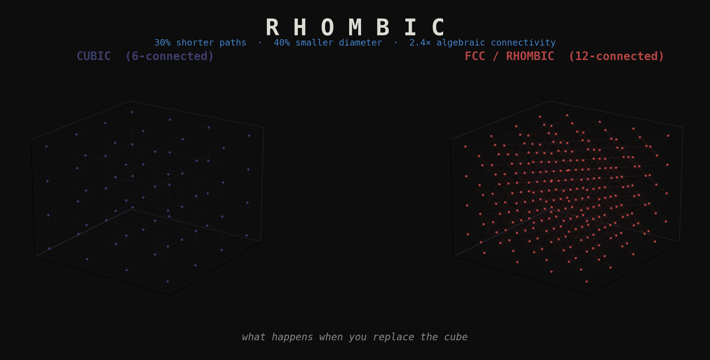
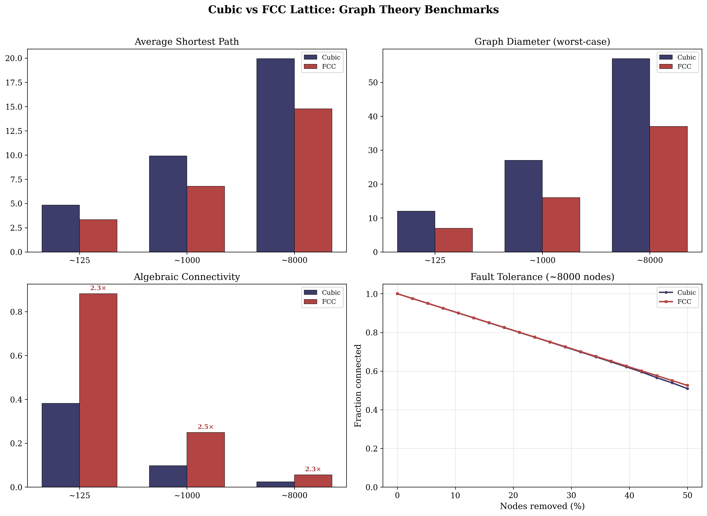

# rhombic

> *The bottleneck is not the processor. It is the shape of the cell.*

A benchmarking library that compares cubic (6-connected) and FCC/rhombic
dodecahedral (12-connected) lattice topologies across graph theory,
spatial operations, and signal processing.

## The Numbers

| Metric | FCC vs Cubic | Scale |
|--------|-------------|-------|
| Average shortest path | **30% shorter** | 125 – 8,000 nodes |
| Graph diameter | **40% smaller** | 125 – 8,000 nodes |
| Algebraic connectivity | **2.4× higher** | 125 – 8,000 nodes |
| Edge cost | ~2× more edges | (the price) |

These ratios are scale-invariant. They hold at every size tested because
they derive from the geometry, not the sample.



## The Question

Computation is built on the cube. Memory is linear. Pixels are square.
Voxels are cubic. Nobody chose this — it accumulated. Descartes gave us
orthogonal coordinates. Von Neumann gave us linear memory. The cubic
lattice is the spatial expression of Cartesian geometry.

Is the cube optimal? This library measures the alternative: the
face-centered cubic lattice, whose Voronoi cells are rhombic
dodecahedra. 12 faces instead of 6. The densest sphere packing in
three dimensions (Kepler, proven Hales 1998). The lattice that nature
uses for copper, aluminum, and gold.

[Read the full thesis →](docs/THESIS.md)

## Quick Start

```bash
pip install rhombic            # minimal (numpy + networkx)
pip install "rhombic[viz]"     # add matplotlib for plots
pip install "rhombic[all]"     # everything including dev tools
```

Reproduce all results:

```bash
python -m rhombic.benchmark
```

Use in code:

```python
from rhombic.lattice import CubicLattice, FCCLattice

cubic = CubicLattice(n=10)     # 1000 nodes, 6-connected
fcc = FCCLattice(n=6)          # ~864 nodes, 12-connected

# Convert to networkx for any graph analysis
G_cubic = cubic.to_networkx()
G_fcc = fcc.to_networkx()
```

## Results

### Rung 1: Graph Theory (complete)

Four metrics, three scales, consistent ratios. The FCC lattice outperforms
the cubic lattice on every measure of routing efficiency and structural
robustness. The cost is bounded: ~2× edges for ~30% shorter paths and
~2.4× robustness.

- [Raw data and tables](results/rung-1/RESULTS.md)
- [What the numbers mean](results/rung-1/INTERPRETATION.md)

### Rung 2: Spatial Operations (next)

Nearest-neighbor search, range queries, flood fill on both topologies.
Does the 30% routing advantage translate to faster spatial computation?

### Rung 3: Signal Processing (planned)

FCC sampling is mathematically optimal for 3D signals (Petersen-Middleton,
1962). The world hasn't adopted it because the cube is the default.

### Rung 4: Context Architecture (planned)

Applying topology findings to AI context management, token neighborhoods,
and multi-agent message routing.

[Full experimental ladder →](docs/EXPERIMENTAL_LADDER.md)

## Philosophy

- Reproducible by default. Every result has code that generates it.
- The geometry is the argument. The numbers are the evidence.
- Cost is always reported alongside benefit.
- Sparse results are data, not failure.

## Contributing

See [CONTRIBUTING.md](CONTRIBUTING.md). We're looking for new topologies,
new metrics, and new rungs on the experimental ladder.

## License

[MPL-2.0](LICENSE) — Use freely. Modifications to library files shared
back to the commons.

## Built by [Promptcrafted](https://promptcrafted.com)
