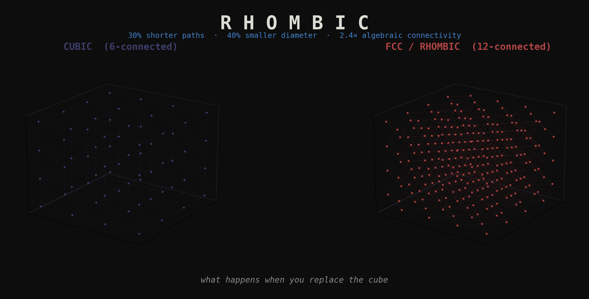
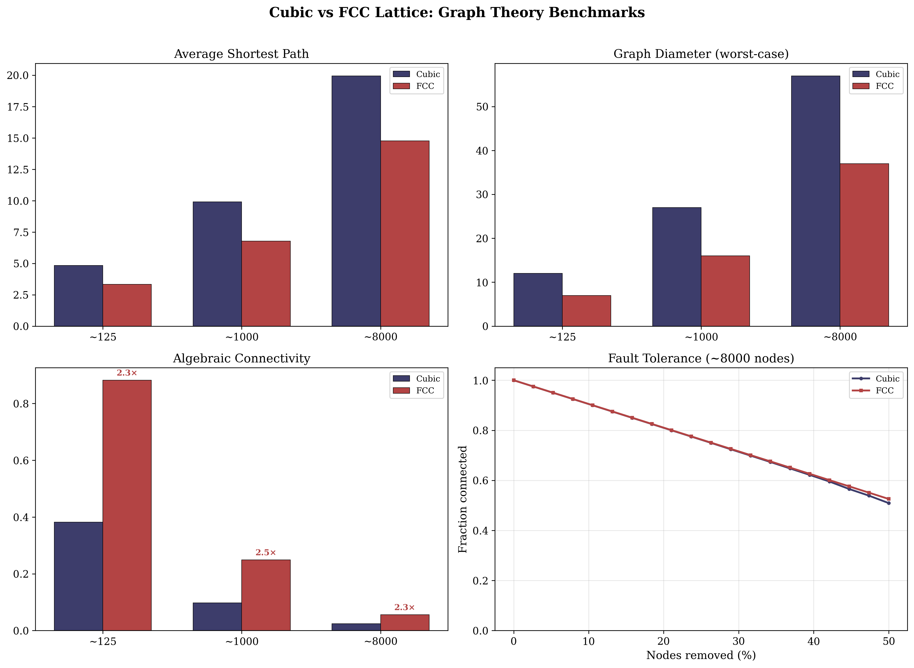
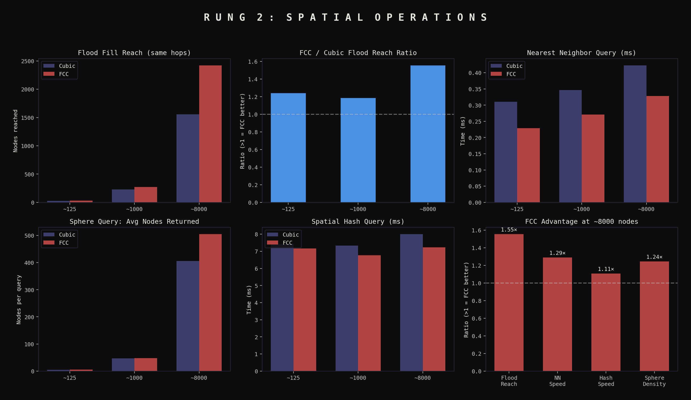
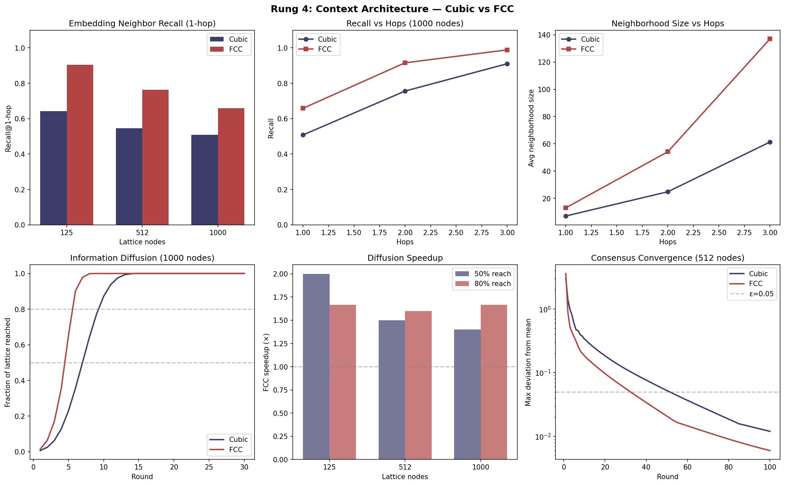

[](https://pypi.org/project/rhombic/)
[](https://github.com/tasumermaf/rhombic/actions/workflows/ci.yml)
[](https://pypi.org/project/rhombic/)
[](https://opensource.org/licenses/MPL-2.0)

# rhombic

> *The bottleneck is not the processor. It is the shape of the cell.*

A benchmarking library that compares cubic (6-connected) and FCC/rhombic
dodecahedral (12-connected) lattice topologies across graph theory,
spatial operations, and signal processing.

> **Research status (July 2026):** two papers are **released** — published
> from this repository, internally audited, not at a formal venue:
> **Asset-1, *The Gauge Is the Obstacle*** (July 29, 2026) and
> **XR-001, *Typed State Beats Prose*** (July 14, 2026). Paper 1, *The Shape
> of the Cell*, is complete but neither published nor submitted; Papers 2–4
> are working drafts under active revision. Corrections and retractions are
> tracked openly — see the Retracted table in
> [results/EXPERIMENT_TRACKER.md](results/EXPERIMENT_TRACKER.md) and the
> equal-edge control in
> [results/EE-001-equal-edge-control/](results/EE-001-equal-edge-control/RESULTS.md).
>
> **Pre-registration discipline (July 2026):** the Asset-1 evidence base is a
> 480-run adapter bank (two model families × six tasks × forty seeds), now
> complete. Every analysis of it (D1/D2/D3/D-aux) was pre-registered before
> the bank finished, and the analysis tools refuse to run on a partial bank —
> a completeness interlock in code, not a convention. Null-model calibration
> runs before trained arms (BM-000, BM-000b hub-motif nulls), and the BM-004
> runner refuses to launch any arm until its positive-control gate passes.
> Designs are reviewed by an independent referee whose rulings are recorded
> verbatim
> ([docs/DIRECTOR_DECISIONS_2026-07-06.md](docs/DIRECTOR_DECISIONS_2026-07-06.md),
> [docs/DIRECTOR_RULING_PREREG_A3A5_2026-07-07.md](docs/DIRECTOR_RULING_PREREG_A3A5_2026-07-07.md));
> deviations are dated amendments, never silent revisions.

## Released Research

### Asset-1: The Gauge Is the Obstacle (July 2026)

*Task Identity, Cross-Family Transfer, and Merge-Conflict Prediction from
Adapter Weights Alone* — Timothy Bielec and Minta Carlson.
[Paper](paper/rhombic-asset1.tex) ·
[page](https://tasumermaf.com/rhombic/gauge/) ·
[features dataset](https://huggingface.co/datasets/timotheospaul/rhombic-asset1-features) ·
[audit ledger](paper/audit/round-2/ADVERSARY_LADDER_LEDGER_ASSET1.md)

A pre-registered bank of 480 LoRA adapters (2 model families × 6 tasks ×
40 seeds) trained on one local GPU, then read out by weights alone. Raw
adapter weights fail to identify the training task (leave-one-out 0.0792 /
0.1375 against chance 0.1667) while GL(*r*)-gauge-canonical features reach
1.0000 — the obstacle is the parameterization, not the information. The
pre-registered no-transfer prediction was **refuted by its own triviality
control**: raw transfer-at-chance was a family-scale artifact, and
standardized transfer runs 0.7375–0.7833. Swapping trained bridges across
tasks costs less than 0.001 nats, where destroying the identity backbone
costs +2.8 / +3.8. Weight-only features predict midpoint-merge conflict at
group-aware AUC 0.995 / 0.962. A pilot correlation of *r* = 0.888 shrank
honestly to *r* = 0.300 at bank scale. Two of five outcomes went against
the pre-registration, and they are the credibility of the other three.
Audited by a 117-finding adversarial ladder, with every headline number
independently re-derived by an isolated Director instance.

### XR-001: Typed State Beats Prose (July 2026)

*A Pre-Registered Measurement of Numeric Corruption Under Agent Context
Compaction* — Timothy Bielec and Minta Carlson.
[Read it](https://tasumermaf.com/rhombic/typed-state/) ·
[paper](paper/rhombic-xr001.tex) ·
[pre-registration](results/XR-001-externalization-pilot/PROTOCOL.md)

At matched token budgets, prose re-encoding corrupts **36.4%** of numeric
facts where typed state blocks corrupt **9.4%** (paired exact McNemar
*p* = 3.524 × 10⁻²¹, direction unanimous across three models). A write-time
decomposition puts most of the prose deficit at the moment of compaction:
typed blocks retain 99.8% of entity values across cascaded checkpoints,
prose 65.2%.

## The Numbers

| Metric | FCC vs Cubic | Scale |
|--------|-------------|-------|
| Average shortest path | **30% shorter** | 125 – 8,000 nodes |
| Graph diameter | **40% smaller** | 125 – 8,000 nodes |
| Algebraic connectivity | **2.3–2.5× higher** | 125 – 8,000 nodes |
| Flood fill reach | **55% more nodes** | 125 – 8,000 nodes |
| NN query speed | **17% faster** | 125 – 8,000 nodes |
| Signal reconstruction | **4-10× lower MSE** | 216 – 1,000 samples |
| Reconstruction isotropy | **5-20× more uniform** | 216 – 1,000 samples |
| Embedding neighbor recall | **+15-26pp at 1-hop** | 125 – 1,000 nodes |
| Information diffusion | **1.4-2× faster** | 125 – 1,000 nodes |
| Edge cost | ~2× more edges | (the price) |

These ratios are stable across all tested scales. They hold at every size
tested, consistent with derivation from Voronoi cell geometry rather than
sample size.

### Scope: what the comparison does and does not show (EE-001)

The table above compares two **spatially-embeddable lattices**. It does not
make FCC a near-optimal graph in the abstract: the equal-edge-count control
([EE-001](results/EE-001-equal-edge-control/RESULTS.md), pre-registered)
shows that a degree-preserving random rewire of the FCC's own edges beats it
4–17× on algebraic connectivity and halves path lengths. Random expanders
win at a fixed edge budget — but they require mean wire lengths 3.5–7.2×
the FCC's nearest-neighbor edges, growing without bound (~N^⅓), and so
cannot be physically embedded with local wiring. **The honest claim:
among spatially-embeddable lattice topologies at matched node count, FCC
dominates cubic — and spatial embeddability is exactly the constraint that
physical domains (routing fabrics, meshes, neighbor lists, spatial data
structures) impose.** Where a task has no spatial metric, this library's
own null results say the geometry does not help
([LEARNINGS.md](docs/LEARNINGS.md): L-001, Exp 2.5).






### Under Structured Weights (Paper 2)

| Metric | Corpus vs Uniform | Scale |
|--------|-------------------|-------|
| Fiedler ratio (direction-weighted) | 2.3x → **6.1x** | 125 – 8,000 nodes |
| Path advantage | 30% → **60% shorter** | 125 – 1,000 nodes |
| Consensus speedup | 1.0x → **6.7x** | 125 nodes |
| Prime-vertex coherence | **p = 0.000025** | Single cell (40,320 permutations) |

Heterogeneous edge weights amplify the FCC advantage. Direction-based
weighting — mapping structured values to the 6 direction pairs of the
FCC lattice — nearly triples the Fiedler ratio. The mechanism is
bottleneck resilience: FCC routes around suppressed edges that strangle
cubic lattices.

- [Raw data and tables](results/paper2/RESULTS.md)
- [What the numbers mean](results/paper2/INTERPRETATION.md)

## The Question

Computation is built on the cube. Memory is linear. Pixels are square.
Voxels are cubic. Nobody chose this — it accumulated. Descartes gave us
orthogonal coordinates. Von Neumann gave us linear memory. The cubic
lattice is the spatial expression of Cartesian geometry.

Is the cube optimal? This library measures the alternative: the
face-centered cubic lattice, whose Voronoi cells are rhombic
dodecahedra. 12 faces instead of 6. The densest sphere packing in
three dimensions (Kepler, proved by Hales 2005, formally
verified 2017). The lattice that nature
uses for copper, aluminum, and gold.

[Read the full thesis →](docs/THESIS.md)

## Quick Start

```bash
pip install rhombic            # minimal (numpy + networkx)
pip install "rhombic[viz]"     # add matplotlib for plots
pip install "rhombic[all]"     # everything including dev tools
```

Reproduce all results:

```bash
python -m rhombic.benchmark
```

Use in code:

```python
from rhombic.lattice import CubicLattice, FCCLattice

cubic = CubicLattice(n=10)     # 1000 nodes, 6-connected
fcc = FCCLattice(n=6)          # ~864 nodes, 12-connected

# Convert to networkx for any graph analysis
G_cubic = cubic.to_networkx()
G_fcc = fcc.to_networkx()
```

Compare topologies:

```python
from rhombic.lattice import CubicLattice, FCCLattice

cubic, fcc = CubicLattice(5), FCCLattice(5)
print(f"Cubic: {cubic.stats().connectivity}-connected, {cubic.stats().node_count} nodes")
print(f"FCC:   {fcc.stats().connectivity}-connected, {fcc.stats().node_count} nodes")
# Cubic: 6-connected, 125 nodes
# FCC:   12-connected, 500 nodes
```

## Results

### Rung 1: Graph Theory (complete)

Four metrics, three scales, consistent ratios. The FCC lattice outperforms
the cubic lattice on every measure of routing efficiency and structural
robustness. The cost is bounded: ~2× edges for ~30% shorter paths and
~2.4× robustness.

- [Raw data and tables](results/rung-1/RESULTS.md)
- [What the numbers mean](results/rung-1/INTERPRETATION.md)

### Rung 2: Spatial Operations (complete)

The routing advantage translates. FCC flood fill reaches 55% more nodes
per hop. Nearest-neighbor queries are 17% faster. Range queries return
24% more nodes per volume (denser packing). The cost: range query time
scales with density — 3-5× slower for sphere/box queries at 8,000 nodes.

- [Raw data and tables](results/rung-2/RESULTS.md)
- [What the numbers mean](results/rung-2/INTERPRETATION.md)

### Rung 3: Signal Processing (complete)

Direct empirical measurements confirm the FCC advantage. FCC spatial sampling
produces **4-10× lower MSE** and **5-20× more isotropic** reconstruction than
cubic sampling at matched sample counts. The advantage peaks in the mid-frequency range (10-60% of
Nyquist) and grows with scale — from +6 dB at 216 samples to +10 dB at 1,000.
Above Nyquist, both lattices alias and cubic's axis alignment accidentally helps.

- [Raw data and tables](results/rung-3/RESULTS.md)
- [What the numbers mean](results/rung-3/INTERPRETATION.md)

### Rung 4: Context Architecture (complete)

Does the FCC advantage survive when the lattice organizes high-dimensional
embedding data? FCC captures **15-26 more percentage points** of an embedding's
true nearest neighbors at 1-hop. Information diffuses **1.4-2× faster**.
Consensus converges 1.58× faster at moderate scale (500 nodes), though
per-neighbor weight dilution reduces the advantage at 1,000 nodes.

- [Raw data and tables](results/rung-4/RESULTS.md)
- [What the numbers mean](results/rung-4/INTERPRETATION.md)

[Full experimental ladder →](docs/EXPERIMENTAL_LADDER.md)

### FCC Embedding Index (complete)

A proof-of-concept ANN index that organizes high-dimensional embeddings on
lattice topology. At matched node counts, the FCC index captures **+7 to +20
percentage points** more true nearest neighbors at 1-hop than the cubic index.
The only variable is the connectivity pattern.

```python
from rhombic.index import FCCIndex, CubicIndex, brute_force_knn

fcc = FCCIndex.from_target_nodes(dim=384, target_nodes=500).build(embeddings)
results = fcc.query(query_vector, k=10, hops=1)
recall = fcc.recall_at_k(queries, ground_truth, k=10, hops=1)
```

- [Raw data and tables](results/index/RESULTS.md)
- [What the numbers mean](results/index/INTERPRETATION.md)

### Paper 2: Weighted Extensions (complete)

What happens when edges carry heterogeneous weights? Seven experiments across
two scales (lattice and single-cell). The FCC advantage **amplifies** under
structured weights — direction-based corpus weighting pushes the Fiedler ratio
from 2.3x to 6.1x. Prime-vertex coherence is significant at the optimal
mapping (p = 0.000025 vs 40,320 alternatives). Spectral bottleneck creation
is universal across 24-edge polytopes, not RD-specific.

- [Raw data and tables](results/paper2/RESULTS.md)
- [What the numbers mean](results/paper2/INTERPRETATION.md)

### Paper 3: The Learnable Bridge (13 experiments) — working draft

Thirteen experiments across four model families (1.1B–14B parameters),
demonstrating that a cybernetic feedback mechanism (the Steersman)
**programs** a specified coupling topology into multi-channel LoRA bridge
matrices. The rhombic dodecahedron is the canonical target, not a discovery:
the geometry does not emerge from data (Exp 2.5 null: co/cross = 1.002,
p = 0.474), and the same controller imprints octahedral, tesseract, and
24-cell targets just as cleanly (see Paper 4). The topology is chosen;
the mechanism is what's demonstrated.

**Key finding:** When the Steersman (contrastive + spectral feedback) is
active at channel count n=6 with RD face-pair supervision, 100% of bridge
matrices develop block-diagonal structure aligned to the three coordinate
planes of the rhombic dodecahedron. Without the Steersman: 0%. The
co-planar/cross-planar coupling ratio peaks at 82,854:1. Structure locks in
by step 200, survives adversarial initialization, and costs 0.17%
validation loss.

**What the bridge is for:** interpretable diagnostics, at benchmark parity.
Bridge fingerprints classify task type at 72.3% leave-one-out accuracy
(linear SVM over 336 individual 36-parameter bridge matrices; chance 33.3%),
bridge deviation tracks the generalization gap at r = 0.888, and a
benchmark head-to-head (BM-001) shows TeLoRA matching standard LoRA on
MMLU/ARC-C/HellaSwag/WinoGrande (aggregate Δ +0.0012). The structure comes
at zero benchmark cost. (An earlier 84.5% fingerprinting figure was
retracted 2026-04-06 — never backed by reproducible computation; see the
Retracted table in [results/EXPERIMENT_TRACKER.md](results/EXPERIMENT_TRACKER.md).)

| Finding | Value |
|---------|-------|
| Block-diagonal rate (cybernetic n=6) | **100%** (42,500+ matrices) |
| Block-diagonal rate (non-cybernetic) | **0%** (570 matrices) |
| Peak co-planar/cross-planar ratio | **82,854:1** |
| Lock-in speed | **~200 steps** (half-life 123 steps) |
| Adversarial initialization suppression | **99.5% in 900 steps** |
| Bridge Fiedler bifurcation (n=6 vs n≠6) | **1,020×** |
| Val loss cost of topology | **0.17% max** |
| Scale invariance | **1.1B, 7B, 14B** (Fiedler converges ~0.10) |

**7-round adversarial audit.** 232 findings across 7 rounds, 87 fixed.
The audit covers Papers 1–3 and predates the April 2026 fingerprinting
correction; Papers 2 and 3 remain **working drafts** — internally audited,
not published, not submitted.

- [Audit trail](paper/audit/) — full findings, hub validations, rewrite log
- [Cross-phase synthesis](results/CROSS_PHASE_SYNTHESIS.md)

### Paper 4: The Topology Programmer — working draft

The Steersman is a general-purpose topology programmer, not an RD-specific
mechanism. Four polytopes confirmed: octahedron (473,622:1 co/cross,
per-bridge mean), rhombic dodecahedron (70,404:1), tesseract (41,564:1;
three same-seed runs mutually consistent at co/cross r ≥ 0.995 — see the
[provenance record](results/t001-provenance/), which documents that the
original run's results file was destroyed by a same-seed relaunch and
recovered from its frozen log), 24-cell (35,808:1).

> ⚠ **Provisional (frozen 2026-07-03):** these ratios were measured in runs
> governed by the adaptive controller, whose stability detector has a known
> defect (declares STABLE while its metric is still moving — see
> [BM_BATTERY_PLAN.md](docs/BM_BATTERY_PLAN.md), Known Issues). They are
> held out of any publication until the detector is fixed and the runs
> re-measured; the `rd_graph` structural-mask results (BM-003, no
> controller) are unaffected. Fixed-weight runs (FC-001, FO-001) are less
> implicated. *(Update 2026-07-07: the Paper 4 audit is complete — all six
> blockers resolved; per-number controller-exposure classification in
> [PAPER4_EXPOSURE_CLASSIFICATION.md](docs/PAPER4_EXPOSURE_CLASSIFICATION.md).
> Re-measurement under the fixed detector remains queued for the post-bank
> GPU window.)*

Four training regimes mapped:
Block-Diagonal, Spectral Attractor (universal band, Fiedler ≈ 0.09),
Hierarchical Coherence, Collapse. Negative controls sharpen the claim:
wrong-label pairs and prime-derived pairs both collapse — geometric
coherence in the pair specification is required. Removing the controller
dissolves the topology within ~100 steps: the Steersman is homeostatic
maintenance, not one-time crystallization.

- [Outline and results](paper/PAPER4_OUTLINE.md) · [Draft](paper/paper4/)

### Synthesis

The complete argument across all four rungs — cultural genealogy, empirical
evidence, cybernetic interpretation, and practical recommendations.

- [The Shape of the Cell: Cubic vs FCC Lattice Topology Across Four Domains](results/SYNTHESIS.md)

## Philosophy

- Reproducible by default. Every result has code that generates it.
- The geometry is the argument. The numbers are the evidence.
- Cost is always reported alongside benefit.
- Sparse results are data, not failure.

## Interactive Agent

`rhombic-agent` — a [Hermes Agent](https://github.com/NousResearch/hermes-agent)
that thinks in 12 dimensions. 9 custom tools + 3 conversational skills. Ask it
to run experiments, generate visualizations, and explain the geometry.

[Hackathon Demo →](https://tasumermaf.github.io/rhombic/)

## Ecosystem

- [Interactive demo](https://huggingface.co/spaces/timotheospaul/rhombic) — try it in your browser
- [The essay](https://timotheospaul.substack.com/p/the-shape-of-the-cell) — the thesis for humans
- [PyPI](https://pypi.org/project/rhombic/) — `pip install rhombic`
- [Full synthesis](results/SYNTHESIS.md) — the complete argument across all four rungs
- [Weighted extensions](results/paper2/RESULTS.md) — what happens under heterogeneous weights

### TeLoRA — Neural Adapter Geometry

**TeLoRA** adds a learnable n×n coupling matrix — the *bridge* —
between the A and B projections in LoRA, adding n² parameters per layer.
When the bridge is the identity matrix, the architecture reduces exactly
to standard LoRA.

The bridge does not improve fine-tuning loss, and it does not hurt it
(BM-001: benchmark parity with standard LoRA across four lm-eval tasks).
It provides something LoRA cannot: a compact, interpretable diagnostic of
adapter behavior — an n²-parameter summary of what training did, readable
without inference or evaluation. A cybernetic feedback mechanism (the
Steersman) can program a chosen topology into the bridge; the rhombic
dodecahedron is the canonical instance, and the mechanism is
topology-agnostic (Paper 4). A structural variant (`rd_graph` mode) builds
the topology in by construction — a fixed adjacency mask with learnable
edge weights, no controller — and is the current experimental frontier
(BM-003).

- Architecture: [`rhombic.nn`](rhombic/nn/) — `RhombiLoRALinear`, topology, bridge init, exact absorption to standard LoRA
- Training: [`scripts/train_cybernetic.py`](scripts/train_cybernetic.py) — full Steersman pipeline
- 28 experimental learnings, nulls and retractions included: [LEARNINGS.md](docs/LEARNINGS.md)

### Papers

Status: Asset-1 and XR-001 are **released** (published from this repository,
not at a formal venue). Paper 1 is **complete** (not yet published). Papers
2–4 are **working drafts** — internally audited, under revision, not
submitted.

- [Asset-1: The Gauge Is the Obstacle](paper/rhombic-asset1.tex) — task identity, cross-family transfer, and merge-conflict prediction from adapter weights alone (480-adapter pre-registered bank). Released July 29, 2026. [Page](https://tasumermaf.com/rhombic/gauge/) · [dataset](https://huggingface.co/datasets/timotheospaul/rhombic-asset1-features)
- [XR-001: Typed State Beats Prose](paper/rhombic-xr001.tex) — numeric corruption under agent context compaction, format as the sole variable. Released July 14, 2026. [Page](https://tasumermaf.com/rhombic/typed-state/)
- [Paper 1: The Shape of the Cell](paper/rhombic.tex) — four-domain topology comparison. Complete.
- [Paper 2: Structured Edge Weights Amplify FCC Lattice Topology](paper/rhombic-paper2.tex) — bottleneck resilience under heterogeneous weights. Draft.
- [Paper 3: The Learnable Bridge](paper/rhombic-paper3.tex) — cybernetic feedback programs coupling topology in multi-channel LoRA; interpretable adapter diagnostics (13 experiments, 4 model families). Draft.
- [Paper 4: The Topology Programmer](paper/paper4/paper4-main.tex) — the Steersman as a general topology programmer across four polytopes; four-regime taxonomy. Draft.

## Contributing

See [CONTRIBUTING.md](CONTRIBUTING.md). We're looking for new topologies,
new metrics, and new rungs on the experimental ladder.

## License

[MPL-2.0](LICENSE) — Use freely. Modifications to library files shared
back to the commons.

## Built by [TASUMER MAF](https://tasumermaf.com)
