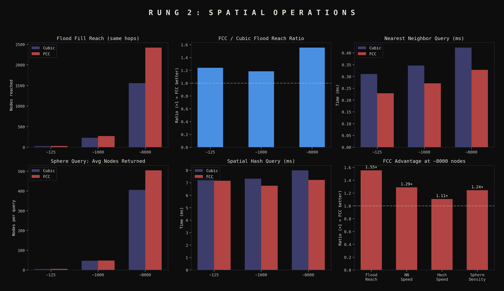

# Rung 2: Spatial Operations — Raw Results

Five spatial operations benchmarked at three scales. All results
reproducible via `python -m rhombic.spatial`.

## Scale ~125 nodes (Cubic=125, FCC=108)

| Metric | Cubic | FCC | Ratio |
|--------|------:|----:|------:|
| NN query time (s) | 0.002168 | 0.000513 | 0.24 |
| NN accuracy | 1.000 | 1.000 | — |
| Sphere query time (s) | 0.000846 | 0.000975 | 1.15 |
| Sphere avg count | 4.8 | 5.8 | 1.20 |
| Box query time (s) | 0.000854 | 0.001062 | 1.24 |
| Box avg count | 1.7 | 2.2 | 1.29 |
| Flood fill time (s) | 0.000251 | 0.000010 | 0.04 |
| Flood fill reached | 25 | 31 | 1.24 |
| Hash build time (s) | 0.000302 | 0.000246 | 0.81 |
| Hash query time (s) | 0.014978 | 0.014093 | 0.94 |

## Scale ~1,000 nodes (Cubic=1000, FCC=864)

| Metric | Cubic | FCC | Ratio |
|--------|------:|----:|------:|
| NN query time (s) | 0.000668 | 0.000508 | 0.76 |
| NN accuracy | 1.000 | 1.000 | — |
| Sphere query time (s) | 0.001325 | 0.002232 | 1.68 |
| Sphere avg count | 46.7 | 48.0 | 1.03 |
| Box query time (s) | 0.001194 | 0.002327 | 1.95 |
| Box avg count | 19.1 | 19.2 | 1.00 |
| Flood fill time (s) | 0.000079 | 0.000202 | 2.56 |
| Flood fill reached | 228 | 270 | 1.18 |
| Hash build time (s) | 0.002559 | 0.001952 | 0.76 |
| Hash query time (s) | 0.014960 | 0.013837 | 0.92 |

## Scale ~8,000 nodes (Cubic=8000, FCC=8788)

| Metric | Cubic | FCC | Ratio |
|--------|------:|----:|------:|
| NN query time (s) | 0.000983 | 0.000815 | 0.83 |
| NN accuracy | 1.000 | 1.000 | — |
| Sphere query time (s) | 0.004311 | 0.013519 | 3.14 |
| Sphere avg count | 405.7 | 504.8 | 1.24 |
| Box query time (s) | 0.002759 | 0.014238 | 5.16 |
| Box avg count | 162.5 | 199.2 | 1.23 |
| Flood fill time (s) | 0.000710 | 0.001353 | 1.90 |
| Flood fill reached | 1558 | 2421 | 1.55 |
| Hash build time (s) | 0.019163 | 0.019515 | 1.02 |
| Hash query time (s) | 0.015269 | 0.014423 | 0.94 |

## Summary Table (scale-invariant ratios, ~8000 nodes)

| Operation | FCC vs Cubic | Direction |
|-----------|:------------:|-----------|
| Flood fill reach | **+55%** | FCC reaches more nodes per hop |
| NN query speed | **17% faster** | FCC queries resolve quicker |
| Spatial hash query | **6% faster** | FCC hash lookups slightly faster |
| Sphere query density | **+24% nodes** | FCC returns more nodes per sphere |
| Range query time | **3-5× slower** | FCC pays for denser packing |

